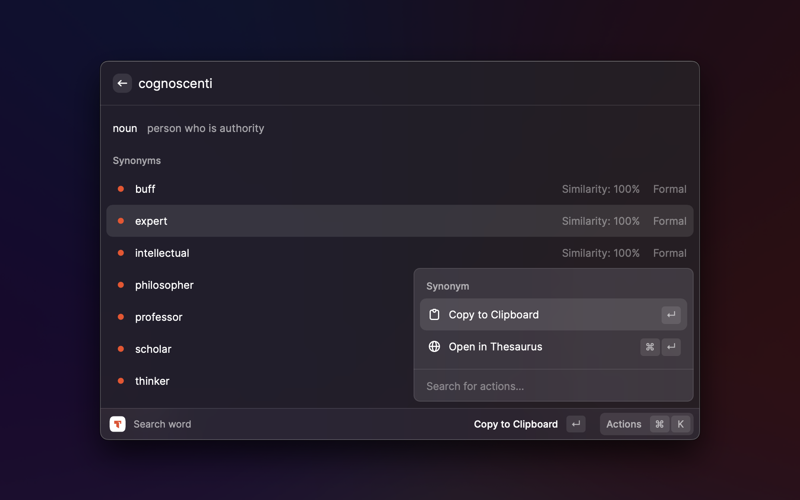

<!-- Improved compatibility of back to top link: See: https://github.com/othneildrew/Best-README-Template/pull/73 -->

<!-- PROJECT LOGO -->
 

  

  <h3 align="center">Thesaurus Raycast Extension/h3>

  

    Search for synonyms and antonyms right inside Raycast
    <!--   -->
    <!-- <a href="https://github.com/othneildrew/Best-README-Template"><strong>Explore the docs »</strong></a> -->
     
     
    <a href="https://undi.cat/raycast/issues">Report Bug</a>
    ·
    <a href="https://undi.cat/raycast/issues">Request Feature</a>
  

<!-- TABLE OF CONTENTS -->

  
Table of Contents

  <ol>
    <li>
      <a href="#about-the-project">About The Project</a>
    </li>
    <li>
      <a href="#getting-started">Getting Started</a>
    </li>
    <li><a href="#roadmap">Roadmap</a></li>
    <li><a href="#contributing">Contributing</a></li>
    <li><a href="#license">License</a></li>
    <li><a href="#contact">Contact</a></li>
  </ol>

<!-- ABOUT THE PROJECT -->

## About The Project

I write in English a lot and find myself looking for a better word, opening up Thesaurus.com and copying the word from there. It isn't convinient. This is why I created this extension; to spend less time looking for words.

(<a href="#readme-top">back to top</a>)

<!-- GETTING STARTED -->

## Getting Started

Hopefully the extension will be available in the Raycast store soon. Until then, to install the extension locally, just clone the repo and add import the extension to Raycast, using the built-in `Import Extension` developer command.

<!-- ROADMAP -->

## Roadmap

- [x] Create basic command
- [x] Read text from the current selection
- [ ] Replace selected text
- [ ] Display further details about the words (similar words, option to which between different meanings, etc.)

See the [open issues](https://undi.cat/raycast/issues) for a full list of proposed features (and known issues).

(<a href="#readme-top">back to top</a>)

<!-- CONTRIBUTING -->

## Contributing

Contributions are what make the open source community such an amazing place to learn, inspire, and create. Any contributions you make are **greatly appreciated**.

If you have a suggestion that would make this better, please fork the repo and create a pull request. You can also simply open an issue with the tag "enhancement".
Don't forget to give the project a star! Thanks again!

1. Fork the Project
2. Create your Feature Branch (`git checkout -b feature/AmazingFeature`)
3. Commit your Changes (`git commit -m 'Add some AmazingFeature'`)
4. Push to the Branch (`git push origin feature/AmazingFeature`)
5. Open a Pull Request

(<a href="#readme-top">back to top</a>)

<!-- LICENSE -->

## License

Distributed under the MIT License. See `LICENSE.txt` for more information.

(<a href="#readme-top">back to top</a>)

<!-- CONTACT -->

## Contact

Balazs Szalay - [@szalayme](https://twitter.com/szalayme) - balazs@szalay.me

(<a href="#readme-top">back to top</a>)

